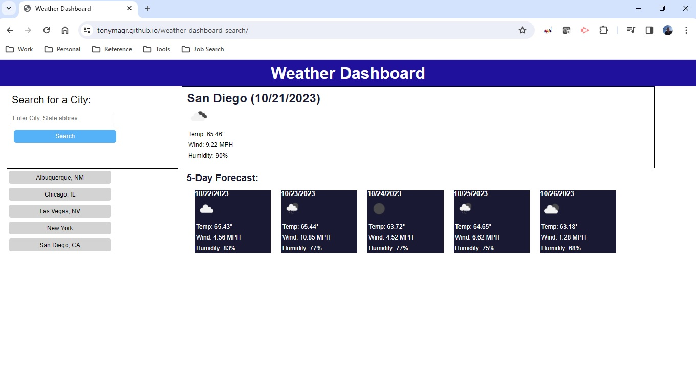

# Weather Dashboard Search - Tony Magrady

## README Author
Tony Magrady - Berkeley Full-Stack Web Development Bootcamp student  
-- October 21, 2023

## Description
Weather Dashboard Search is built for a traveler who wants to see the weather outlook for multiple cities and plan a trip accordingly.
Can enter search by city or city & state, which makes API call to openweathermap.org.
The search renders current and forecast weather to the page.
The search also saves search history in the form of a list of buttons and using local storage.
When a button is clicked, the forecast for that city is recalled and displayed. Local storage stores unique id, lattitude and longitude of the city -  id for internal array lookup and lat and long for the API call.  The jQuery script features dynamically updated HTML and CSS.  
https://tonymagr.github.io/weather-dashboard-search/

Module 6 skills and tools that I used in webpage deployment were:
- Use of 3rd party API calls; getting familiar with their documentation to know how best to contruct and use their API interface.
- Dynamic styling updates with jQuery
- Dynamic element creation with jQuery
- jQuery event listeners
- New coding technique to manage dynamic rotation of previous search buttons
- Refresher on local storage save and retrieval

## Website Image

## Challenges
The biggest challenge was to resolve an issue with previous search buttons duplicating. This was due to not initializing an object that collects data on each search, and it caused the button text and the array (of button data) to get out of sync. A TA helped me figure out the issue. By initializing the object and also by directly appending the new button instead of refreshing the list of all buttons from storage every time, the issue was resolved. 
Another challenge was to find the correct entries from the 5-day forecast calls to openweathermap.org. I made them at Noon each day as a representative time for each day's expected temperature, etc. The challenge was that the user can use the webpage at any time of day, and the future forecast is a rolling forecast 3 hours at a time. I used an hour adjustment addend to determine the needed index to the returned API data.
Finally, there was a challenge to ensure the id for the right button could still be targeted after the first button in the list was removed. The table would always readjust the first index back to zero, but the new first button after old first button removal would be left with id > 0. The list of buttons had to keep an extra counter for the number of searches that pushed the number of buttons past its maximum (thus requiring to remove the first button).

## Installation
N/A

## Usage
Travelers who want to see the weather outlook one or more cities can plan their trip accordingly.
The local storage behaves somewhat like local cache, such that each city searches are stored and retrieved locally. 

## Credits
A teacher's assistant (TA) helped me figure out an issue with previous search buttons duplicating.

## License
MIT License

Copyright (c) 2023 Tony Magrady

Permission is hereby granted, free of charge, to any person obtaining a copy
of this software and associated documentation files (the "Software"), to deal
in the Software without restriction, including without limitation the rights
to use, copy, modify, merge, publish, distribute, sublicense, and/or sell
copies of the Software, and to permit persons to whom the Software is
furnished to do so, subject to the following conditions:

The above copyright notice and this permission notice shall be included in all
copies or substantial portions of the Software.

THE SOFTWARE IS PROVIDED "AS IS", WITHOUT WARRANTY OF ANY KIND, EXPRESS OR
IMPLIED, INCLUDING BUT NOT LIMITED TO THE WARRANTIES OF MERCHANTABILITY,
FITNESS FOR A PARTICULAR PURPOSE AND NONINFRINGEMENT. IN NO EVENT SHALL THE
AUTHORS OR COPYRIGHT HOLDERS BE LIABLE FOR ANY CLAIM, DAMAGES OR OTHER
LIABILITY, WHETHER IN AN ACTION OF CONTRACT, TORT OR OTHERWISE, ARISING FROM,
OUT OF OR IN CONNECTION WITH THE SOFTWARE OR THE USE OR OTHER DEALINGS IN THE
SOFTWARE.

---